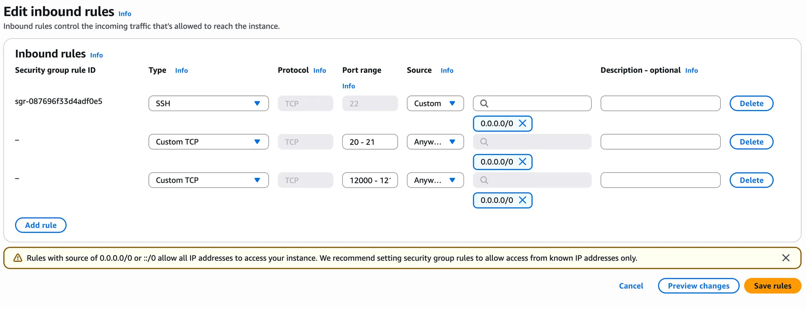
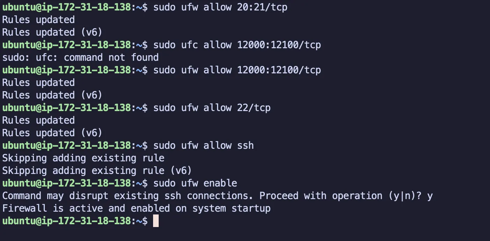
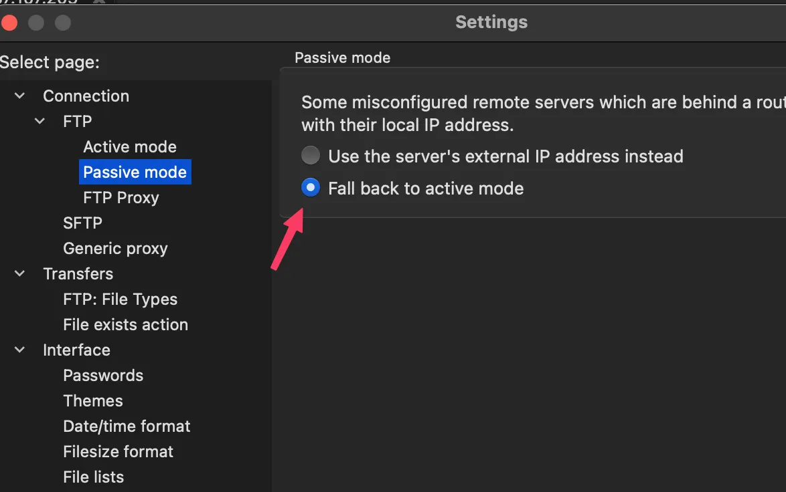
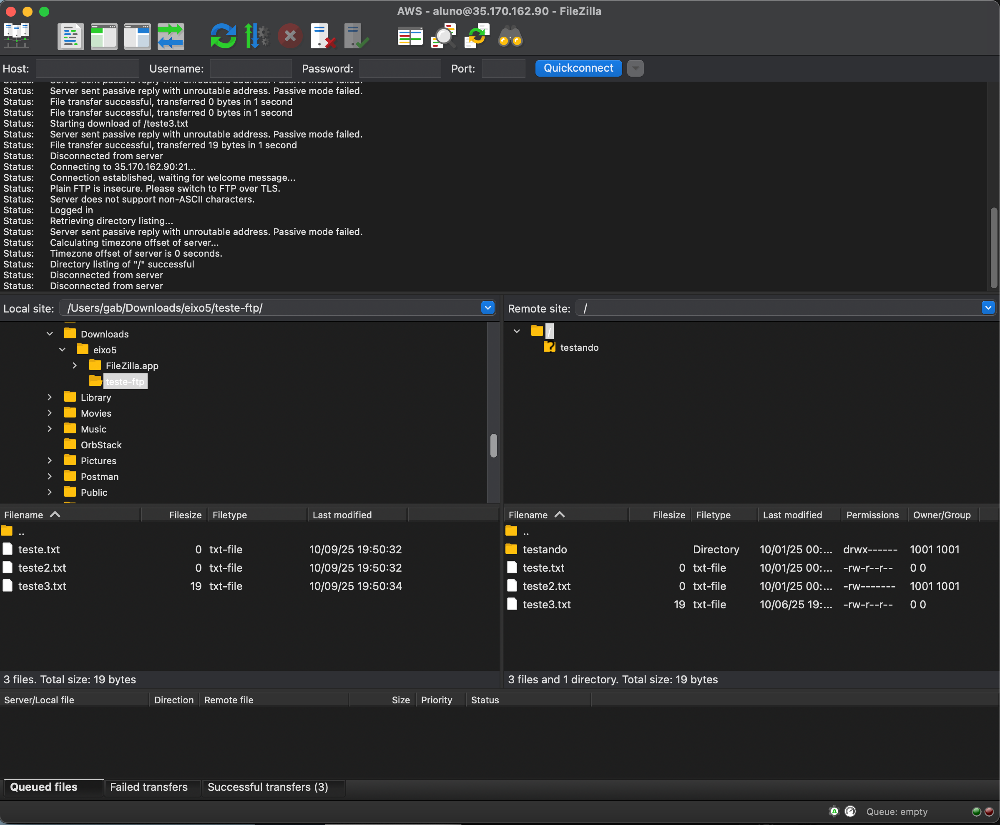
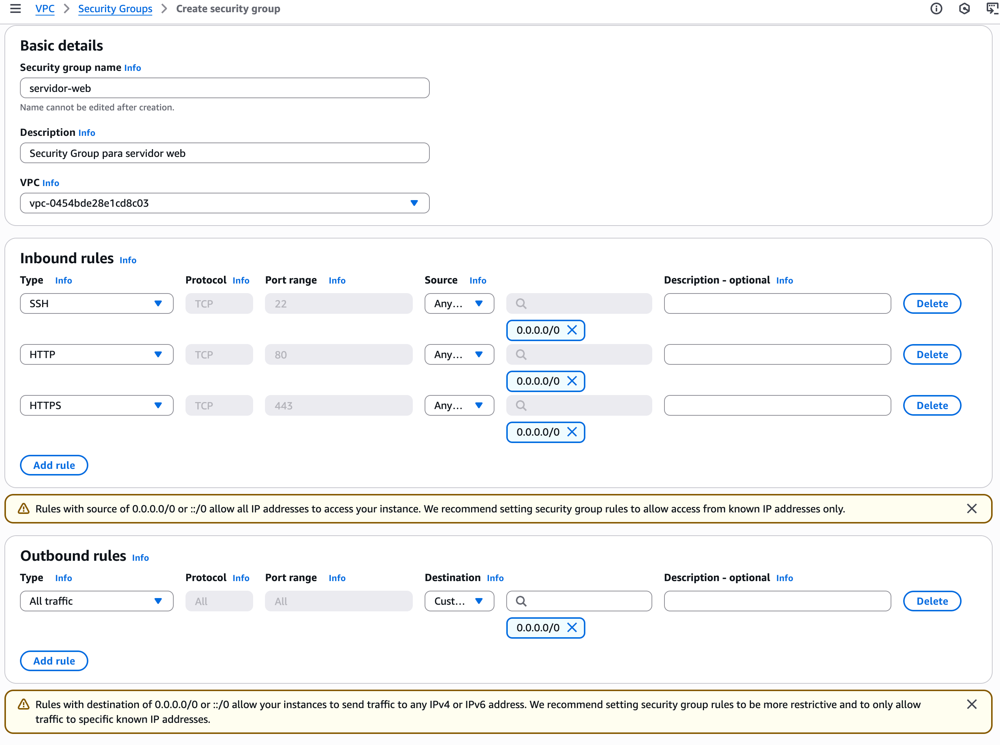
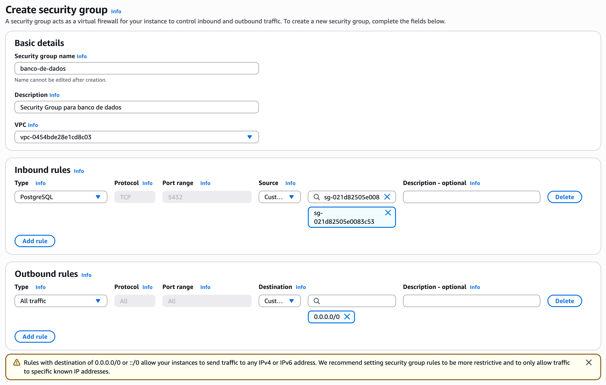
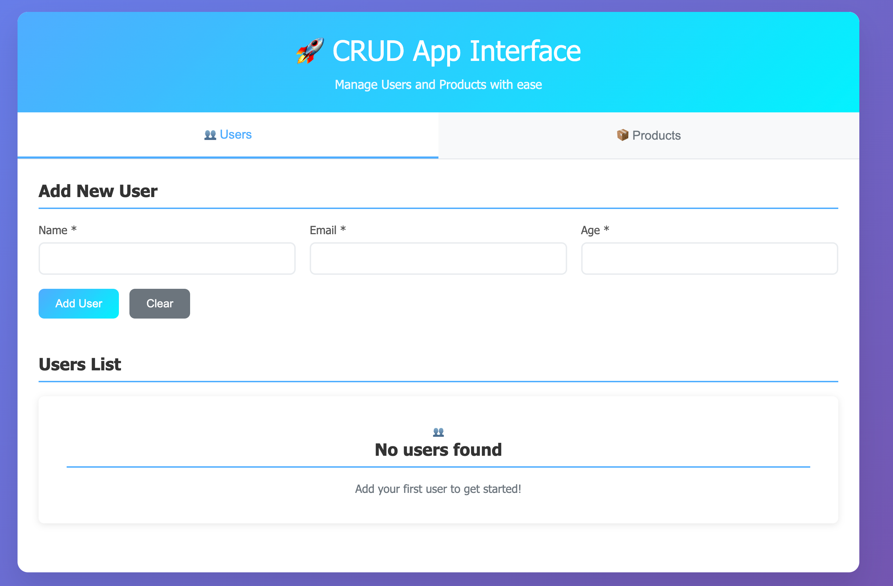

# Ata de Configuração - Etapa 2

## Resumo do Projeto

Este documento registra o processo completo de configuração dos serviços de infraestrutura em instâncias EC2 da AWS ou On Premise, incluindo configurações de segurança, firewall e testes de conectividade para cada serviço implementado.

## Objetivo

Implementar uma infraestrutura completa com múltiplos serviços essenciais para um ambiente corporativo, garantindo segurança e funcionalidade adequadas.

## Membros do Grupo e Responsabilidades

| Membro | Serviço | Status | Descrição |
|--------|---------|--------|-----------|
| Gabriel dos Reis Nascimento | Servidor FTP (vsftpd) | ✅ Concluído | Implementação de servidor FTP seguro para compartilhamento de arquivos com acesso controlado. |
| Gabriel dos Reis Nascimento | Servidor Web + Banco de Dados | ⏳ Pendente / ✅ Concluído | Configuração de servidor web com banco de dados integrado para aplicações corporativas. |
| [Nome do Membro] | AD com DNS e GPO | ⏳ Pendente / ✅ Concluído | Configuração do Active Directory com serviços de DNS e implementação de Group Policy Objects. |
| [Nome do Membro] | VPN (OpenVPN) | ⏳ Pendente / ✅ Concluído | Configuração de servidor VPN utilizando OpenVPN para acesso remoto seguro. |
| [Nome do Membro] | Servidor DHCP | ⏳ Pendente / ✅ Concluído | Implementação de servidor DHCP para gerenciamento automático de endereços IP na rede. |

## Detalhamento das Implementações

### 📁 Servidor FTP (vsftpd) - Gabriel dos Reis Nascimento

#### Configuração do Servidor

##### 1. Acesso à VM

- Conectado à instância EC2 via SSH
- Sistema operacional: Ubuntu
- Usuário: ubuntu

##### 2. Instalação do vsftpd

```bash
sudo apt install vsftpd -y
```

##### 3. Verificação do Status do Serviço

```bash
sudo service vsftpd status
```

**Resultado**: Serviço instalado e rodando

##### 4. Configuração das Regras de Entrada (Inbound Rules) da EC2

- **Porta 22**: 0.0.0.0/0 (SSH)
- **Portas 20-21**: 0.0.0.0/0 (Custom TCP)
- **Portas 12000-12100**: 0.0.0.0/0 (Custom TCP)



##### 5. Configuração do Firewall UFW

```bash
sudo ufw allow 20:21/tcp
sudo ufw allow 12000:12100/tcp
sudo ufw allow 22/tcp
sudo ufw allow ssh
sudo ufw enable
```

**Status do Firewall**:

- Regras aplicadas com sucesso
- Firewall ativado e funcionando



##### 6. Criação de Usuário FTP

```bash
sudo useradd aluno
sudo passwd aluno
# Senha definida: aluno123
```

**Detalhes do usuário**:

- Nome: aluno
- Senha: aluno123
- Diretório home: /home/aluno

##### 7. Backup da Configuração Original

```bash
sudo cp /etc/vsftpd.conf /etc/vsftpd.conf.bkp
```

**Arquivo de backup**: `/etc/vsftpd.conf.bkp`

##### 8. Configuração do vsftpd.conf

Adicionadas as seguintes configurações no arquivo `/etc/vsftpd.conf`:

```bash
userlist_deny=NO
userlist_file=/etc/vsftpd/user_list
tcp_wrappers=NO

# Caminho de compartilhamento
local_root=/home/aluno/dados
chroot_local_user=YES
allow_writeable_chroot=YES
```

**Explicação das configurações**:

- `userlist_deny=NO`: Permite acesso apenas aos usuários listados
- `userlist_file`: Arquivo contendo lista de usuários autorizados
- `local_root`: Diretório raiz para o usuário FTP
- `chroot_local_user=YES`: Restringe usuário ao diretório home
- `allow_writeable_chroot=YES`: Permite escrita no diretório restrito

##### 9. Criação do Arquivo de Lista de Usuários

```bash
sudo mkdir -p /etc/vsftpd
sudo vim /etc/vsftpd/user_list
```

**Conteúdo do arquivo `/etc/vsftpd/user_list`**:

```bash
aluno
```

##### 10. Configuração do Diretório de Compartilhamento

```bash
sudo mkdir -p /home/aluno/dados
sudo chown aluno /home/aluno/dados
cd /home/aluno/
ls -l
```

**Resultado**:

```bash
total 4
drwxr-xr-x 2 aluno root 4096 Oct  1 03:18 dados
```

##### 11. Reinicialização do Serviço

```bash
sudo service vsftpd restart
sudo service vsftpd status
```

**Status**: Serviço reiniciado com sucesso

##### 12. Teste Local

```bash
ftp aluno@localhost
```

**Resultado do teste**:

```bash
Connected to localhost.
220 (vsFTPd 3.0.5)
331 Please specify the password.
Password:
230 Login successful.
Remote system type is UNIX.
Using binary mode to transfer files.
```

#### Testes de Conectividade Externa

##### 1. Configuração do Elastic IP

- **IP Público**: `35.170.162.90`
- Associado à instância EC2 para acesso externo consistente

##### 2. Conexão SSH via Elastic IP

```bash
ssh -i "Eixo5_2025.2.pem" ubuntu@35.170.162.90
```

##### 3. Teste via FileZilla

- **Host**: `35.170.162.90`
- **Usuário**: aluno
- **Senha**: aluno123
- **Porta**: 21 (padrão)
- **Modo**: Passivo (recomendado)

**Configurações importantes no FileZilla**:

- Marcar opção "Modo Passivo" para evitar problemas de firewall


**Resultado do teste**:



##### Resultados Obtidos

##### ✅ Sucessos

1. Servidor FTP instalado e configurado com sucesso
2. Usuário criado com acesso restrito ao diretório `/home/aluno/dados`
3. Firewall configurado corretamente
4. Teste local bem-sucedido
5. Elastic IP configurado para acesso externo
6. Conexão externa via FileZilla funcionando

#### Conclusão do FTP

A configuração do servidor FTP foi concluída com sucesso, permitindo acesso seguro e controlado aos arquivos compartilhados. O sistema está operacional tanto para testes locais quanto para acesso externo via internet.

---

### 📁 Servidor Web + Banco de Dados - Gabriel dos Reis Nascimento

#### Configuração do Servidor

##### 1. Configurar Security Groups

##### 1.1. Security Group para servidor web

- Nome: `servidor-web`
- Descrição: `Security Group para servidor web`
- Regras de entrada:
  - SSH: `0.0.0.0/0:22`
  - HTTP: `0.0.0.0/0:80`
  - HTTPS: `0.0.0.0/0:443`
- Regras de saída:
  - Todos: `0.0.0.0/0:0`



##### 1.2. Security Group para banco de dados

- Nome: `banco-de-dados`
- Descrição: `Security Group para banco de dados`
- Regras de entrada:
  - PostgreSQL do security group `servidor-web`: `0.0.0.0/0:5432`
- Regras de saída:
  - Todos: `0.0.0.0/0`



##### 2. Criar o RDS PostgreSQL

- Nome: `postgres-crud-database`
- Engine: PostgreSQL
- Versão: `17.4-R1`
- Template: Sandbox
- Instance class: `db.t4g.micro`
- Storage type: `gp2`
- Storage: `20GB`
- Security Group: `banco-de-dados`
- Initial database: `test_database`

##### 3. Criar o EC2 para o servidor web

- Nome: `servidor-web`
- Sistema operacional: Ubuntu 24.04 LTS
- Tipo de instância: `t3.micro`
- Security Group: `servidor-web`
- Storage: `8GB`

##### 4. Configurar o servidor web

##### 4.1. Acessar o servidor web

```bash
ssh -i "[chave-ssh]" ubuntu@[ip-do-servidor-web]
```

##### 4.2. Clonar o repositório e executar o script de instalação do Docker

```bash
mkdir app
cd app
git clone [url-do-repositorio] .
sudo ./install-docker-ubuntu.sh
```

Sair da sessão SSH e entrar novamente para aplicar as alterações.

##### 4.3. Configurar o ambiente

```bash
cp env.production.example .env
```

###### 4.3.1. Editar o arquivo .env com as credenciais do RDS

```bash
vim .env
# Editar o arquivo .env com as credenciais do RDS
```

##### 4.4. Deploy

```bash
docker-compose -f docker-compose.prod.yml --env-file .env up -d --build
```

##### 4.5. Atualizar security group do servidor web

Adicionar regra de entrada para porta 3000 do security group do servidor web para que seja possível acessar as rotas da API pela internet.

##### 5. Testar a API

###### 5.1. Teste de saúde

```bash
curl --location '[ip-do-servidor-web]:3000/health' \
--header 'Content-Type: application/json' \
--data ''
```

###### 5.2. Teste de usuários

```bash
curl --location '[ip-do-servidor-web]:3000/api/users' \
--header 'Content-Type: application/json' \
--data-raw '{"name": "John Doe", "email": "john@example.com", "age": 30}'
```

```bash
curl --location '[ip-do-servidor-web]:3000/api/users' \
--header 'Content-Type: application/json'
```

###### 5.3. Teste de produtos

```bash
curl --location '[ip-do-servidor-web]:3000/api/products' \
--header 'Content-Type: application/json' \
--data-raw '{"name": "Product 1", "description": "Description 1", "price": 100, "stock": 10}'
```

```bash
curl --location '[ip-do-servidor-web]:3000/api/products' \
--header 'Content-Type: application/json'
```

#### 6. Configurar o Nginx

```bash
sudo apt update
sudo apt install -y nginx
sudo systemctl start nginx
sudo systemctl enable nginx
sudo apt install make -y
make nginx-setup
```

#### 7. Testar no navegador

1. Acessar o servidor web via browser no endereço `http://[ip-do-servidor-web]`
2. Validar que a interface de CRUD está sendo exibida corretamente.
3. Testar adicionar usuários e produtos.



---

**Grupo**: Eixo 5 - LOGAM Tech
